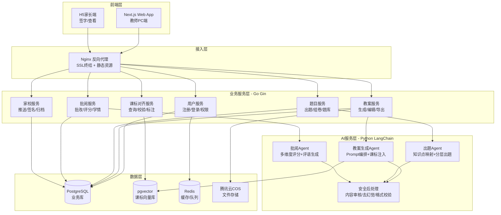

## 产品概述

**智课Pro** 是一期为小学+初中（1-9年级）语文、数学、英语三科教师设计的AI教案平台。定位为"AI辅助+教师审核"的备课伙伴，而非全自动替代工具。一期围绕"备、练、评"三大核心教学环节，打通教案备课、出题组卷、习作指导、智能批阅、家长签字五大功能闭环，并以课标对齐引擎（P0）作为教育合法性根基，确保所有AI生成内容可溯源至《义务教育课程标准（2022年版）》。

## 核心功能

### 1. 教案备课（AI智能写案）

- 输入课文题目+课时信息，自动生成结构化教案（教学目标、重难点、教学过程、设计意图、板书设计、课后反思模板）
- 每一条教学目标自动标注对应课标条目编号与原文引用
- 支持"一键改格式"：适配地区教研/学校检查的不同教案模板（三维目标版、核心素养版、大单元教学版）
- "我的教案模板"：AI学习教师个人风格偏好，记住教学偏好（导入方式、互动环节偏好、作业量级等）
- 教案雷同度检测：与同年级同学科其他教案对比相似度，给出差异化建议

### 2. 出题组卷

- "给个题目/知识点，出一套"：输入单元主题或知识点，自动生成分层练习卷（基础+提升+拓展）
- 每道题目标注对应课标条目和难度层级
- 题型覆盖：选择题、填空题、简答题、阅读理解题、应用题、作文题
- 自动去重：与教师历史出题记录比对，避免重复使用相同题目

### 3. 习作指导

- 作文题自动生成：给定题目，生成写作指导（审题提示、结构框架、素材推荐、范文参考）
- 分层指导：针对不同水平学生提供差异化写作支架（基础版/进阶版）
- AI润色建议：学生提交习作后，提供具体的修改建议和提升方向

### 4. 智能批阅

- 客观题自动批改（选择题、填空题），主观题AI预打分+教师确认
- 作文批阅：AI从内容、结构、语言、书写四个维度给出初步评价，教师复核调整
- 批阅结果自动生成学情分析摘要（班级整体+单个学生）
- 准确率分题型承诺：客观题≥99%，主观题作为参考不替代教师判断

### 5. 家长签字

- 教师推送批阅结果和学情摘要给家长
- 家长端（H5轻量版）查看孩子作业/试卷情况、AI学情建议
- 电子签名确认，教师端可追踪签字状态（已签/未签/逾期）
- 家校沟通记录归档，支持学期末汇总导出

## 技术栈

| 层 | 选型 | 说明 |
| --- | --- | --- |
| 前端 | Next.js 14 (App Router) + TypeScript | 全栈前端，SSR/SSG，教师PC Web为主 |
| 前端UI | Tailwind CSS + shadcn/ui | 快速构建，可定制，现代设计 |
| 后端 | Go 1.22 + Gin | 单体服务，RESTful API，后续可拆微服务 |
| AI编排 | Python 3.12 + LangChain | 独立AI服务，与Go后端通过HTTP/gRPC通信 |
| 大模型 | 通义千问 API (qwen-plus) | 主力生成模型，性价比最优，数据不出境 |
| 向量存储 | pgvector (PostgreSQL扩展) | 课标RAG检索，与业务数据库统一管理 |
| 关系数据库 | PostgreSQL 16 | 用户、教案、题目、批阅等业务数据 |
| 缓存/会话 | Redis 7 | 会话管理、热点缓存、异步任务队列 |
| 文件存储 | 腾讯云COS | 教案Word/PDF导出、学生习作附件 |
| 部署 | Docker Compose | 单机4C8G，MVP月成本<3000元 |
| 监控 | Prometheus + Grafana | 基础监控，关注API延迟和AI生成质量 |


## 系统架构



## 数据流核心路径

### 教案生成流程（最核心路径）

```
教师输入(课文+课时+偏好) 
→ Go教案服务(参数校验+认证) 
→ Python教案Agent(RAG检索课标+Pompt编排) 
→ 通义千问API(大模型生成) 
→ 安全后处理(内容审核+格式校验+课标标注) 
→ Go教案服务(存储+返回) 
→ 前端渲染(可编辑教案+课标映射可视化)
```

### 课标对齐引擎数据流

```
课标文档(2022版PDF) → 结构化解析(人工拆解+AI辅助) 
→ JSON知识库(学科/学段/领域/条目) 
→ pgvector向量化(bge-large-zh-v1.5) 
→ 教案生成时RAG检索(语义相似度Top-5条目) 
→ Prompt注入(课标原文作为约束条件) 
→ 生成后比对校验(目标↔课标映射评分)
```

## 目录结构

```
AI教案/
├── 产品规划                    # [已存在] 专家评审综合报告
├── 技术文档                    # [NEW] 技术方案详细文档
├── code/
│   ├── frontend/               # Next.js 前端
│   │   ├── src/
│   │   │   ├── app/            # App Router 页面路由
│   │   │   │   ├── (auth)/     # 登录/注册
│   │   │   │   ├── (dashboard)/ # 教师工作台
│   │   │   │   │   ├── lesson-plans/    # 教案备课
│   │   │   │   │   ├── exercises/       # 出题组卷
│   │   │   │   │   ├── compositions/    # 习作指导
│   │   │   │   │   ├── grading/         # 批阅管理
│   │   │   │   │   └── parent-sign/     # 家长签字
│   │   │   │   └── layout.tsx
│   │   │   ├── components/     # 通用UI组件
│   │   │   │   ├── ui/         # shadcn/ui 基础组件
│   │   │   │   ├── lesson-plan/ # 教案编辑器/预览/课标标注
│   │   │   │   ├── exam/       # 题目生成/组卷
│   │   │   │   └── common/     # 导航/表单/导出等
│   │   │   ├── lib/            # 工具函数/API封装
│   │   │   └── styles/         # 全局样式
│   │   ├── tailwind.config.ts
│   │   ├── next.config.js
│   │   └── package.json
│   ├── backend/                # Go Gin 后端
│   │   ├── cmd/
│   │   │   └── server/main.go  # 服务入口
│   │   ├── internal/
│   │   │   ├── handler/        # HTTP处理器
│   │   │   ├── service/        # 业务逻辑层
│   │   │   ├── repository/     # 数据访问层
│   │   │   ├── model/          # 数据模型
│   │   │   ├── middleware/      # 认证/日志/限流中间件
│   │   │   └── config/         # 配置管理
│   │   ├── migrations/         # PostgreSQL迁移脚本
│   │   └── go.mod
│   ├── ai-service/             # Python AI服务
│   │   ├── agents/
│   │   │   ├── lesson_plan_agent.py   # 教案生成Agent
│   │   │   ├── exam_agent.py          # 出题Agent
│   │   │   ├── grading_agent.py       # 批阅Agent
│   │   │   └── safety_filter.py       # 安全后处理
│   │   ├── rag/
│   │   │   ├── curriculum_loader.py   # 课标数据加载
│   │   │   ├── vector_store.py        # pgvector操作
│   │   │   └── retriever.py           # 课标检索
│   │   ├── prompts/            # Prompt模板
│   │   ├── api_server.py       # FastAPI服务入口
│   │   └── requirements.txt
│   ├── curriculum-data/        # 课标结构化数据
│   │   ├── 2022_yiwu_yuwen.json    # 2022版义教语文课标
│   │   ├── 2022_yiwu_math.json     # 2022版义教数学课标
│   │   └── 2022_yiwu_english.json  # 2022版义教英语课标
│   ├── docker-compose.yml      # 开发环境编排
│   └── README.md
```

## 关键数据结构

### 课标条目结构化模型

```typescript
interface CurriculumStandard {
  id: string;                    // 如 "yuwen-3-4-yuedu-001"
  subject: "语文" | "数学" | "英语";
  stage: "1-2年级" | "3-4年级" | "5-6年级" | "7-9年级";
  domain: string;                // 如 "阅读与鉴赏"、"数与代数"
  code: string;                  // 如 "3.2.1"
  content: string;               // 课标原文
  competency_dimension: string;  // 核心素养维度
  quality_standard: string;      // 学业质量标准
  embedding: number[];           // 向量（768维）
}
```

### 教案数据模型核心字段

```typescript
interface LessonPlan {
  id: string;
  teacher_id: string;
  subject: string;
  grade: string;
  textbook_unit: string;        // 教材单元
  lesson_title: string;         // 课题
  period: number;               // 课时

  objectives: LessonObjective[]; // 教学目标（含课标标注）
  key_points: string[];         // 教学重点
  difficult_points: string[];   // 教学难点
  process: TeachingStep[];      // 教学过程
  design_intent: string;        // 设计意图
  board_design: string;         // 板书设计
  reflection_template: string;  // 课后反思模板

  curriculum_alignments: CurriculumAlignment[]; // 课标映射
  format_template: string;      // 格式模板标识

  ai_generated: boolean;
  manual_edited: boolean;
  edit_count: number;           // 教案修改率指标
  similarity_score: number;     // 雷同度分数
  created_at: string;
}
```

## 设计风格

采用**现代教育科技风格**——融合了极简主义的干净秩序感与教育产品的温暖亲和力。整体以明亮柔和的暖白色为基调，搭配深邃的学术蓝作为主色调，辅以活力的教育橙作为行动引导色，营造"专业但不冰冷、智能但有温度"的产品气质。

**页面规划（4个核心页面）**：

### 1. 教师工作台首页

- **布局**：左侧全局导航栏（教案/出题/习作/批阅/家长签字/我的），右侧内容区
- **顶栏**：LOGO + "智课Pro" + 学科/年级切换器 + 通知中心 + 头像
- **核心区**：今日待办卡片（待批阅×N、家长未签×N、教案草稿×N），快捷入口卡片（新建教案/快速出题/查看学情），最近教案时间线（最近5份，展示编辑状态）
- **底部信息栏**：本周教案生成数、修改率趋势、课标覆盖率

### 2. 教案编辑器（核心页面）

- **顶部工具栏**：课题输入框 + 课时选择 + 格式模板切换（三维目标/核心素养/大单元）+ 一键生成按钮
- **左侧课标面板**：可折叠，显示当前教案已对齐的课标条目（绿色已覆盖/黄色部分覆盖/灰色未覆盖），支持点击查看原文
- **中央编辑区**：分块编辑器——教学目标（每条的课标标注徽章）、重难点、教学过程（可拖拽排序的时间轴卡片）、设计意图、板书设计、课后反思
- **右侧AI助手**：输入指令微调某一部分、雷同度检测结果、格式预览切换
- **底部浮层**：保存状态（自动保存）、修改统计（修改率）、导出Word/PDF

### 3. 批阅工作台

- **顶部**：班级选择器 + 作业/试卷切换 + 筛选（已批/未批/全部）
- **中间双栏布局**：左侧学生列表（头像+姓名+提交状态），右侧批阅区（原题/AI预打分/教师修改框/评语模板按钮）
- **AI辅助标记**：客观题自动打勾叉（绿色/红色），主观题AI评分浮动标签（可点击调整），作文批阅四维雷达图（内容/结构/语言/书写）
- **底部操作栏**：上一人/下一人、批量通过AI评分、推送家长签字

### 4. 家长签字H5页

- **轻量卡片式布局**：教师头像+科目+日期
- **作业/试卷摘要卡片**：得分/等级、AI评语摘要、薄弱知识点标签
- **学情趋势迷你图**：最近5次成绩折线
- **电子签名区**：手写签名板 + "确认已阅"按钮
- **底部**：查看原始批阅详情链接（展开教师详细批注）

## 交互设计要点

- **渐进式操作**：教案生成分步骤引导（输入课题→确认课标→选择模板→预览→编辑），而非一键盲出
- **即时反馈**：AI生成采用流式输出（SSE），所见即所得，教师可随时中断和微调
- **容错设计**：所有AI生成内容均可手动编辑，修改痕迹保留，支持版本回溯
- **触达效率**：40岁以上教师适配"三步出教案"模式——输入课题→点生成→调格式，减少选项负担

## 智能体扩展

### SubAgent

- **code-explorer**
- 用途：在项目初期探索现有代码库结构，确认文件布局和已有资源
- 预期结果：输出当前代码库完整文件树和关键文件内容摘要，为后续开发提供准确基线