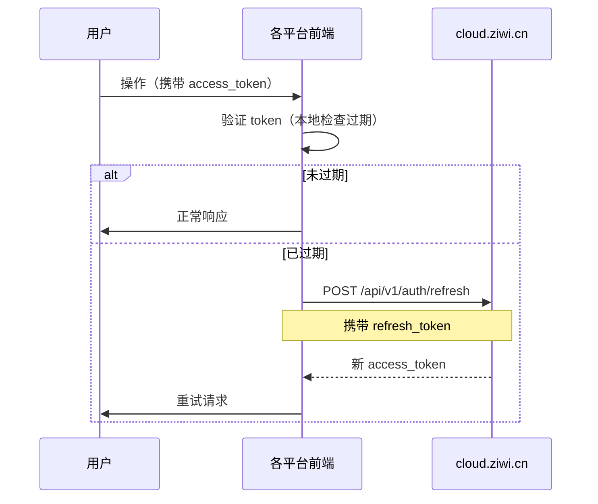

# 知微多产品 SaaS 平台统一身份与授权体系 · 总体说明

> 文档用途：供 school / mfg / cloud 三方团队评审，明确 cloud/mfg/school 三者的架构关系与对接方式
> 版本：v0.3（基线修正稿，H1/H2/H3 已修）
> 日期：2026-07-10

> ⚠️ **统一基线声明（v0.2 据 mfg/cloud 评审反馈修订；v0.3 据实测核对修正 §3.3 与措辞，现文档为权威基线，请 mfg / cloud / school 团队以本稿为准）**
>
> 1. **JWT claim 字段名统一为 `products`**（**字符串数组**，如 `["school","mfg"]`）：经 cloud 端代码实测（`jwt_service.py:25`），cloud IdP **始终注入 `products`，从未注入过 `features`**；历史上 mfg 旧代码曾读取 `features` 造成不一致，mfg 已完成迁移、当前代码 `payload.get("products", [])` 按字符串数组跑通。**因此 v0.2 原描述「cloud 实际注入 features」措辞有误，以本段为准**。**决议**：cloud 维持主发 `products`；过渡期**保留双发 `features`（值同 `products`）** 仅作旧消费方兼容，对 mfg 非必需；后续可停发。§3.3 的对象数组示例已据本基线修正为字符串数组。
> 2. **私有部署心跳参数统一为「每 1 小时上报 / 连续 24 小时无心跳即失联降级」**：与《补充需求书合集》§6.2 对齐，原讨论稿的「每天 1 次 / 3 天失联」作废。详见 §5.5。
>
> 以上两项为三方对接契约基线，如有异议请在评审中反馈，否则按此执行。

---

## 1. 整体架构概览

### 1.1 为什么需要 cloud.ziwi.cn

知微目前有多个独立产品线，各自有独立的用户体系和认证方式：

| 产品线 | 当前认证方式 | 问题 |
|:-------|:------------|:-----|
| school.ziwi.cn（教育） | 自有用户表 + 自有 JWT | 用户无法跨产品使用 |
| mfg.ziwi.cn（制造） | 待部署，原计划自建认证 | 同上 |
| 未来：AI赋能 / 财税审计等 | — | 若各自建认证，账号完全割裂 |

**核心诉求**：一个用户（平台运营人员 / 租户管理员 / 跨产品用户）用一个账号登录，就能访问所有他有权使用的产品。

### 1.2 三层架构

```
┌─────────────────────────────────────────────────────────┐
│  cloud.ziwi.cn                                          │
│  统一登录门户 + 平台管理后台                              │
│                                                         │
│  ┌──────────┐  ┌──────────────┐  ┌──────────────────┐   │
│  │ 身份认证  │  │ 平台运营管理  │  │ License/对账/开票 │   │
│  │ (IdP)    │  │ 租户/成员/运维 │  │ 统一采购/按产品  │   │
│  │          │  │              │  │ 记帐/发票中心     │   │
│  └────┬─────┘  └──────────────┘  └──────────────────┘   │
│       │                                                  │
│       │ 签发 RS256 JWT（含 tenant_id + products claims）   │
└───────┼─────────────────────────────────────────────────┘
        │
        ├──────────┬──────────┬──────────┐
        ▼          ▼          ▼          ▼
   ┌────────┐ ┌────────┐ ┌────────┐ ┌──────────┐
   │ mfg    │ │ school │ │ AI赋能 │ │ 财税审计  │
   │.ziwi.cn│ │.ziwi.cn│ │(未来)  │ │ (未来)    │
   └────────┘ └────────┘ └────────┘ └──────────┘
        │          │
        │ 各自验证 cloud.ziwi.cn 签发的 JWT
        │ 各平台只负责自己的业务逻辑
        ▼
   ┌─────────────────────────────────────┐
   │ api.ziwi.cn（可选统一）              │
   │ AI 推理 / 文件存储 / 通知 / 审计日志  │
   └─────────────────────────────────────┘
```

### 1.3 职责边界

| 层次 | 职责 | 不做 |
|:-----|:-----|:-----|
| **cloud.ziwi.cn** | 账号登录、JWT签发、平台运营管理、License采购/对账 | 不承载任何业务页面 |
| **各产品线**（mfg/school/...） | 自身的业务功能、租户用户端、业务API | 不自行签发JWT（信任 cloud JWT） |
| **api.ziwi.cn**（可选） | AI推理、文件存储、通知等公共能力 | 不涉及业务逻辑 |

---

## 2. 域名与 DNS 规划

### 2.1 域名分配

| 域 | 用途 | 环境 |
|:---|:-----|:-----|
| **cloud.ziwi.cn** | 统一登录门户 + 平台管理后台（Phase 1 = 仅IdP） | **新建** |
| **mfg.ziwi.cn** | 制造平台：门户 / SaaS管理端 / 租户管理端 / 租户用户端（`*.mfg.ziwi.cn`） | **待部署** |
| **mfg1.ziwi.cn** | 制造预发布环境（纯HTTP，路径路由） | **待部署** |
| **school.ziwi.cn** | 教育平台（已有） | **已有** |
| **school1.ziwi.cn** | 教育预发布（已有） | **已有** |

### 2.2 DNS 记录

| 主机记录 | 类型 | 值 | 用途 | SSL |
|:---------|:----|:---|:-----|:----|
| `cloud` | A | 193.112.163.147 | 统一登录门户 | ✅ 单域名证书 |
| `mfg` | A | 193.112.163.147 | 制造生产门户 | ✅ 通配证书 |
| `*.mfg` | A | 193.112.163.147 | 制造租户用户端 | ✅ 通配证书 |
| `mfg1` | A | 193.112.163.147 | 制造预发布 | ❌ 纯HTTP |
| `school` | A | 193.112.163.147 | 教育（已有） | ✅ 已有 |
| `school1` | A | 193.112.163.147 | 教育预发布（已有） | ✅ 已有 |

---

## 3. cloud.ziwi.cn 统一身份平台

### 3.1 Phase 1 范围（极简 IdP — 已编码完成）

| 功能 | 状态 |
|:-----|:-----|
| 用户注册（邮箱+密码+显示名） | ✅ 已实现 |
| 用户登录 → 签发 RS256 JWT | ✅ 已实现 |
| Token 刷新 | ✅ 已实现 |
| 公钥接口（JWK 格式）供各平台验证 | ✅ 已实现 |
| 当前用户信息查询 | ✅ 已实现 |
| 用户查询 / 更新 products | ✅ 已实现 |
| Vue 3 登录页 + 注册页 | ✅ 已实现 |
| Docker 化（docker-compose） | ✅ 已实现 |
| 15 个测试全通过 | ✅ 已验证 |

### 3.2 Phase 2 规划（不上线当前进度的障碍）

- 平台运营管理 UI（租户列表、成员管理）
- License 采购 / 对账 / 开票
- 多产品路由页面（登录后看到有权限的产品卡片）
- 平台监控 / 运维功能

### 3.3 JWT 格式

```json
{
  "header": {"alg": "RS256", "kid": "key_v1", "typ": "JWT"},
  "payload": {
    "sub": "550e8400-e29b-41d4-a716-446655440000",
    "email": "admin@acme.com",
    "tenant_id": "acme_factory",
    "products": ["mfg", "school"],
    "iat": 1700000000,
    "exp": 1700086400
  }
}
```

**关键字段说明：**

| 字段 | 说明 | 使用方 |
|:-----|:-----|:-------|
| `sub` | 用户 UUID | 各平台识别用户身份 |
| `email` | 用户邮箱 | 各平台匹配已有账号 |
| `tenant_id` | 用户所属租户 | 各平台做多租户隔离 |
| `products` | 用户有权限的产品标识列表（**字符串数组**，如 `["mfg","school"]`） | 各平台判断该用户能访问哪些产品 |

> **H2 明确（角色 / License 不进 JWT）**：`roles`（用户在产品内的角色，如 `tenant_admin`）走**各产品本地角色体系**；`license_exp`（License 到期）走 **License 服务 / DB**（见 §6）。二者均**不塞入 JWT**，避免与字符串数组模型冲突、也避免 License 状态被长时效 token 缓存。§3.3 旧版对象数组写法（含 `roles`/`license_exp` 嵌套）作废。

---

## 4. 各产品线对接方式

### 4.1 对接总流程

```
用户访问 school.ziwi.cn（未登录）
           │
           ▼
  重定向到 cloud.ziwi.cn/login
           │
           ▼
  用户在 cloud 登录
           │
           ▼
  cloud 签发 JWT
           │
           ▼
  前端拿到 JWT → 携带 JWT 跳回 school.ziwi.cn
           │
           ▼
  school 后端验证 JWT 签名
    ↓              ↓
 验证通过         验证失败
    │               │
    │               └→ 返回 401，前端跳回 cloud 登录
    │
  提取 payload 中的 tenant_id 和 products
    │
  判断是否有 school 产品的访问权限
    │
  放行请求，建立用户 session
```

### 4.2 school.ziwi.cn 对接所需改动

**后端改动（最小）：**

1. 新增 JWT 验证中间件（或装饰器），可选启用
2. 信任 cloud.ziwi.cn 的 RSA 公钥（通过 `/api/v1/auth/public-key` 获取）
3. 解析 JWT payload，提取 `email` 字段与 school 已有用户匹配
4. 可能需要在 school 用户表增加 `cloud_user_id` 字段做映射

```python
# school 后端伪代码示意
def verify_cloud_token(token: str) -> dict:
    # 1. 从 cloud 获取公钥（可缓存，TTL 1小时）
    jwks = cloud_client.get_public_key()
    # 2. 按 kid 选择对应公钥
    key = select_key_by_kid(jwks, extract_kid(token))
    # 3. 验证 RS256 签名
    payload = jwt.decode(token, key, algorithms=["RS256"])
    return payload

# 在需要 cloud 认证的接口中使用
@app.get("/api/v1/courses")
async def list_courses(token = Depends(verify_cloud_token)):
    user = find_or_create_user_by_email(token["email"])
    # 继续业务逻辑...
```

**前端改动（如有）：**

- 在登录按钮增加「使用知微云账号登录」选项
- 或直接全部迁移到 cloud.ziwi.cn 登录页跳转

**迁移策略：**

| 阶段 | 操作 | 对现有用户的影响 |
|:-----|:-----|:----------------|
| 1. 并行期 | school 保留现有登录 + 增加 cloud JWT 验证选项 | 无影响，老用户照常 |
| 2. 绑定期 | 用户在 cloud 首次登录时，按 email 匹配 school 已有账号创建绑定 | 用户无感知 |
| 3. 迁移期 | 逐步引导用户使用 cloud 登录，关闭旧登录入口 | 提前通知 |

### 4.3 mfg.ziwi.cn 对接

mfg 从第一天就信任 cloud JWT，不做任何"兼容旧认证"的工作：

- mfg 后端直接验证 cloud JWT（不走自己的登录逻辑）
- 用户访问 mfg 页面 → 检查是否有有效 token → 无则跳 cloud 登录
- mfg 后端通过 JWT 的 `products` 字段判断该用户是否有制造权限

### 4.4 公钥获取与缓存策略

```
各平台后端                   cloud.ziwi.cn
    │                            │
    │  GET /api/v1/auth/public-key
    │────────────────────────────>
    │                            │
    │  200 {keys: [              │
    │    {kid: "key_v1", ...},   │
    │    {kid: "key_v2", ...}    │
    │  ]}                        │
    │<────────────────────────────│
    │                            │
    │  缓存公钥（本地缓存 1 小时） │
    │  按 kid 选择对应公钥        │
    │  验证 JWT 签名              │
```

---

## 5. License / Token 授权流程

### 5.1 总体模型

```
cloud.ziwi.cn
   │
   ├── 统一管理 License（各产品线的授权）
   │   ├── 产品线维度（mfg / school / ai / 财税...）
   │   ├── 租户维度（某租户购买了哪些产品的 License）
   │   └── 用户维度（某用户有哪些产品的访问权限）
   │
   ├── 签发 JWT（products 字段体现用户的授权状态）
   │
   └── 对账 / 开票（按产品维度分拆）
```

### 5.2 License 数据结构

```json
{
  "license_id": "LIC-MFG-2026-001",
  "product": "mfg",
  "tenant_id": "acme_factory",
  "start_date": "2026-01-01",
  "expire_date": "2026-12-31",
  "modules": ["bom", "spc", "ppap", "fmea"],
  "max_users": 50,
  "status": "active"
}
```

### 5.3 授权校验流程

```
用户请求 → 携带 cloud JWT
↓
各平台后端验证 JWT 签名
↓
检查 JWT.products 是否包含本产品
  ├── 包含 → 放行
  └── 不包含 → 拒绝（返回403，提示"无此产品 License"）
```

**Phase 1 简化**：JWT 中的 products 列表由管理员通过 `PATCH /api/v1/users/{id}/products` 手动配置。

**Phase 2 完整**：cloud.ziwi.cn 管理后台提供 License 管理界面，自动同步到用户 JWT。

### 5.4 Token 刷新与过期



| Token | 有效期 | 存储位置 | 说明 |
|:------|:-------|:---------|:-----|
| `access_token` | 30 分钟 | 前端内存 / localStorage | 业务请求认证 |
| `refresh_token` | 7 天 | localStorage / httpOnly cookie | 用于刷新 access_token |

### 5.5 私有部署的 License 管理

私有部署版（离线学校/工厂）可裁剪 cloud 依赖：

- 使用本地 License 文件（离线激活码方式）
- 内置轻量 IdP（不做统一身份，只做本地登录）
- 可选向 `heartbeat.ziwi.cn` 上报心跳（含 License 有效期信息）
- 心跳频率：**每 1 小时**上报一次（crontab / 定时任务）
- 失败重试：连续失败重试 3 次，间隔 5 分钟
- 到期提醒：到期前 30 天/7 天站内通知
- 离线检测：**连续 24 小时无成功心跳 → 标记失联 + 标红 + 告警邮件，并进入降级模式**（限制新建/云端能力，已有内容只读；心跳恢复后自动解除）
- 注：本段参数已与《补充需求书合集》§6.2 对齐，原「每天 1 次 / 3 天失联」作废
- ⚠️ **H5（服务端阈值待对齐）**：`heartbeat.ziwi.cn` 当前服务端配置为 `timeout=15min + misses=3 ≈ 45min` 即判失联；若客户端按 1h 上报，服务端会在 45min 误判失联，**与上方 24h 基线严重冲突**。需改服务端配置，建议值：**`check=60`（分钟）/ `timeout=60`（分钟）/ `misses=24`**（即连续 24 次检查失败≈24h 判失联）。属心跳服务端小配置变更，需动手改运行服务（见评审 §H5），**待授权后执行，建议先 staging 验证再上生产**。

---

## 6. 部署架构

### 6.1 服务拓扑

```
193.112.163.147（腾讯云 CVM）
│
├── Nginx（宿主机）
│   ├── cloud.ziwi.cn → cloud 容器栈
│   ├── mfg.ziwi.cn → mfg 容器栈
│   ├── school.ziwi.cn → school 容器栈（已有）
│   └── school1.ziwi.cn → school 预发布（已有）
│
├── Docker 容器栈
│   ├── cloud-stack（新建）
│   │   ├── cloud-backend (:8000)
│   │   ├── cloud-frontend (:80 → Nginx)
│   │   └── cloud-db (PostgreSQL, :5432)
│   │
│   ├── mfg-stack（待部署）
│   │   ├── mfg-backend (:8090)
│   │   ├── mfg-frontend / admin-frontend
│   │   └── mfg-db (PostgreSQL)
│   │
│   └── school-stack（已有）
│       ├── zhiwei-backend-prod (:8080)
│       ├── zhiwei-backend-staging (:8081)
│       └── school-db (PostgreSQL)
```

### 6.2 cloud.ziwi.cn 上线步骤（你来执行）

| 步骤 | 操作 | 预计耗时 |
|:-----|:-----|:---------|
| 1 | scp cloud/ 目录到服务器 | 2 分钟 |
| 2 | 创建 cloud.ziwi.cn nginx 配置（我写你贴） | 5 分钟 |
| 3 | DNS 添加 cloud A 记录 → 193.112.163.147 | 2 分钟 |
| 4 | 申请 cloud.ziwi.cn SSL 证书（acme.sh） | 2 分钟 |
| 5 | docker-compose -f cloud/docker-compose.yml up -d | 3 分钟 |
| 6 | 验证 `curl https://cloud.ziwi.cn/health` | 1 秒 |

---

## 7. school.ziwi.cn 迁移路径

### 7.1 要做的事

| 任务 | 优先级 | 复杂度 | 说明 |
|:-----|:-------|:-------|:-----|
| school 用户表加 `cloud_user_id` 字段 | P0 | 低 | 空字段，不阻塞现有功能 |
| school 后端新增 JWT 验证中间件（可选启用） | P0 | 中 | 增加 `verify_cloud_token` 依赖 |
| school 前端增加「知微云登录」入口 | P1 | 中 | 登录页加一个按钮 |
| school 用户首次 cloud 登录 → 自动绑定 | P1 | 中 | 按 email 匹配，创建映射 |
| 逐步关闭 school 旧登录入口 | P2 | 低 | 等所有用户完成迁移 |

### 7.2 不阻塞上线的条件

school 可以先上 cloud 的 **公钥获取 + JWT 验证** 能力，但**不强制**用户使用。对现有用户零影响。

### 7.3 风险与对策

| 风险 | 对策 |
|:-----|:------|
| school 与 cloud 的 email 不匹配 | 允许手动绑定（管理员操作） |
| school 用户表已存在大量用户 | 增量迁移，不要求一次性完成 |
| 迁移过程中用户体验下降 | 并行期保留旧登录方式 |

---

## 8. 待 school 团队评审的问题

以下问题需要 school 团队给出输入：

1. **school 当前用户模型**：用户表有哪些字段？密码存储方式？
2. **school 当前 JWT/认证**：是自研还是用框架？token 格式、有效期？
3. **school 是否已在多租户场景？** 如有，tenant_id 如何管理？
4. **迁移时间窗口**：school 团队希望在什么时间窗口内完成迁移？
5. **私有部署场景**：school 团队是否有离线的教育机构需要支持？
6. **school 的技术栈**：后端语言/框架？方便做 JWT 验证开发吗？

---

## 9. 附录

### 9.1 参考文献

| 文档 | 路径 |
|:-----|:-----|
| cloud.ziwi.cn 架构方案 | `docs/cloud-idp-architecture.md` |
| 制造 SaaS 部署规划 | `docs/mfg-env-deployment-plan.md` |
| 域名策略 V2.1 | `docs/20260620-全域名需求表.md` |
| 域名规划分析 | `docs/20260620域名规划分析.md` |
| 租户系统管理设计 V2 | `docs/tenant-sysadmin-design-v2.md` |
| 私有部署 License 心跳 | `docs/extensibility-design.md` |

### 9.2 关键 API 清单

| 端点 | 方法 | 说明 | 是否需要认证 |
|:-----|:------|:-----|:------------|
| `/api/v1/auth/register` | POST | 注册新用户 | 否 |
| `/api/v1/auth/login` | POST | 登录，签发 JWT | 否 |
| `/api/v1/auth/refresh` | POST | 刷新 access_token | 否（需 refresh_token） |
| `/api/v1/auth/me` | GET | 当前用户信息 | 是（需 Bearer token） |
| `/api/v1/auth/public-key` | GET | RSA 公钥（JWK 格式） | 否 |
| `/api/v1/users/{id}` | GET | 查询用户 | 是 |
| `/api/v1/users/{id}/products` | PATCH | 更新用户 products | 是 |
| `/health` | GET | 健康检查 | 否 |
