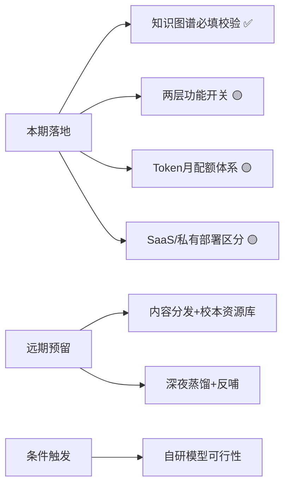

# 知微AI教学助手 — 产品战略讨论总结

> 日期：2026-06-24  
> 状态：方案讨论完成，待分期落地  
> 参与：老P（项目经理）+ AI 技术顾问

---

## 一、讨论背景

在 MVP 代码已有基础上（2026-06-22 刚完成教学上下文同步修复），进行了一次深度产品战略讨论，涵盖功能开关设计、Token 配额体系、部署模式区分、内容分发架构、自研模型可行性等6个方向。

---

## 二、六大讨论模块

### 模块一：知识图谱必填校验逻辑 ✅ 已编码

**问题**：缺省值已经有了，是否还需要必填校验？

**结论**：两者互补，职能不同：
- **缺省值**：降低操作成本，自动选中当前课题对应知识点
- **必填校验**：防止用户手动清空所有知识点后提交空内容

**实现**：`LessonPlanEditor.tsx` 中 `handleGenerate` 入口校验 + 按钮 disabled 联动 + UI 红色 `*必选` 标记。

**相关文件**：`code/frontend/src/pages/LessonPlanEditor.tsx`

---

### 模块二：知识图谱两层功能开关 🟡 待编码

**设计**：

```
学校总开关（School.EnableKnowledgeGraph）
    │
    ├── ON → 教师个人开关（TeachingContext.knowledgeGraphEnabled）自由切换
    │
    └── OFF → 教师个人开关置灰 + 关闭状态
               教师点击 → 弹窗"是否向校方申请开启？"
               确认 → 二次确认"确定要发送申请给学校管理员？"
               是 → 发送申请消息给学校管理员
```

**关键交互细节**：
| 学校开关 | 教师开关状态 | 教师端行为 |
|---------|------------|-----------|
| ON | 教师自由 ON/OFF | 知识图谱正常显示/隐藏 |
| OFF | 置灰 + 关闭 | 知识图谱不显示，点击弹出申请流程 |
| OFF | 已发送申请（pending） | "已申请，等待管理员审批" |

**技术要点**：
- 学校开关：后端 `School` 表字段
- 教师开关：前端 `localStorage` 存储，每次切换校验学校开关状态
- 申请消息：通过通知系统发送给学校管理员

**本期状态**：待编码

---

### 模块三：Token 月配额体系 🟡 待编码

**数据模型**：

```
School
  ├── DefaultTokenQuota (全校默认月配额)
  └── 批量设置接口

User (教师)
  ├── TokenQuotaMonthly (月配额，默认继承 School.DefaultTokenQuota)
  ├── TokenQuotaCustom (是否自定义配额)
  ├── TokenUsedMonthly (当月已用)
  └── TokenResetDate (配额重置日，每月1日)

TokenUsageLog
  ├── user_id
  ├── consumed_at
  ├── scene (教案生成/出题/批改/小微对话/知识图谱)
  ├── tokens_in / tokens_out
  └── school_id
```

**学校管理端交互**：
- 全校默认配额设置（`DefaultTokenQuota`）
- 教师列表 → 多选 → 批量设配额 / 恢复默认
- 推荐套餐：1万 / 3万 / 5万 / 10万 / 不限

**教师端可视化**：
| 位置 | 展示方式 | 内容 |
|------|---------|------|
| TopNavBar | 进度环（轻量） | 已用/总额，百分比 |
| SettingsPage | 进度条 + 详情 | 分类消耗（教案/出题/批改/小微），趋势图 |

**3 级预警**：
| 级别 | 阈值 | 行为 |
|------|------|------|
| 提示 | 剩余 < 20% | TopNavBar 变黄 |
| 警告 | 剩余 < 10% | 弹窗提醒 + 变橙 |
| 阻断 | 剩余 = 0 | 拦截 AI 调用，提示联系管理员 |

**技术要点**：
- `TokenQuotaGuard` 中间件拦截所有 AI 路由
- 小微助手默认消耗配额（不受知识图谱开关影响）
- 私有部署版配额同样从学校配额扣除

**本期状态**：待编码

---

### 模块四：SaaS / 私有部署模式区分 ✅ 方案确定

**核心区别**：

| 维度 | SaaS 版 | 私有部署版 |
|------|---------|-----------|
| 教师登录 | 手机号 + 验证码 | 用户名 + 密码（校方管理员配置） |
| 手机字段 | 必填 | 可选（校方 OA 同步可能不需要） |
| 密码管理 | 短信验证码 | 管理员设置 / OA 系统同步 |
| 部署控制 | `DEPLOY_MODE=saas` | `DEPLOY_MODE=private` |
| License | 云端心跳 | 本地 + 云端心跳 |

**技术要点**：
- 环境变量 `DEPLOY_MODE` 控制登录流程分支
- 私有部署版注册页：仅管理员可见 "添加教师" 界面
- 教师登录：用户名 + 密码，无 "忘记密码" → 联系管理员重置

**本期状态**：方案确定，待编码

---

### 模块五：内容分发与校本资源库 🔵 本期不做，预留设计

> ⚠️ **本期不涉及**，但架构需预留扩展点。

**整体架构**：

```
云端内容中心
    │
    ├── 内容采集（全网抓取 + 运营上传 PDF/扫描件）
    │
    ├── 内容构建自动化
    │   ├── OCR → 结构化 → 向量化入库
    │   └── 按教材版本 + 年级段分类打包
    │
    ├── 内容分发
    │   └── 定时下发匹配校方年级段 + 教材版本的题库/教辅包
    │
    └── 内容反哺
        └── 接收学校端蒸馏数据

学校端（校本资源库）
    │
    ├── 教师上传（PDF / 扫描件 / Word）
    ├── AI 结构化（OCR + 知识点标注 + 难度评级）
    ├── 深夜蒸馏（定时任务，凌晨执行）
    │   └── 5 层自动审核管道
    └── 优质内容反哺云端中心
```

**深夜蒸馏 — 5 层自动审核管道（零人工）**：

| 层级 | 审核内容 | 通过标准 | 不通过处理 |
|------|---------|---------|-----------|
| L1 格式校验 | 文件完整性、可读性 | 格式合规且内容可提取 | 标记"格式异常"退回 |
| L2 内容安全 | 敏感词、违规内容 | 机器审核通过 | 标记"安全风险"隔离 |
| L3 质量评分 | 大模型评分（0-100） | ≥ 70 分 | 标记"低质量"进废弃池 |
| L4 向量查重 | 与云端已有内容比对 | 相似度 < 85% | 标记"重复"进废弃池 |
| L5 交叉验证 | 同一知识点多源交叉比对 | 一致性 ≥ 3 源 | 标记"争议"进人工复核 |

**综合分计算**：L3 质量分 × 0.5 + (1 - L4 相似度) × 100 × 0.3 + L5 一致性 × 0.2 ≥ 80 → 自动入库

**废弃池机制**：
- 所有未通过但非安全风险的内容进入废弃池
- 管理员可手动复活到内容库
- 废弃池定期清理（90天）

**自愈反哺**：
- 使用数据（教师采纳率、修改率、复用次数）反馈给评分模型
- 高使用率内容加权推送
- 低使用率内容降权或下沉

**预留点**：
- 内容库数据表结构预定义（不在本期建表）
- API 端点预留命名空间 `/api/v1/content/`
- 蒸馏任务调度接口预留
- 前端导航栏预留 "资源库" 入口（disabled）

**本期状态**：架构预留，零代码实现

---

### 模块六：垂直领域自研模型可行性 🔵 本期不做

> ⚠️ **前提**：内容积累到一定量级方可启动，本期不涉及。

**4 阶段路径**：

| 阶段 | 内容 | 数据需求 | 何时启动 |
|------|------|---------|---------|
| 阶段一 | RAG 检索增强（课标/教材/题库） | 基础内容库构建完成 | MVP 即可 |
| 阶段二 | 7B 参数微调（出题/批改等确定性任务） | 10万+ 高质量题目 + 批改标注 | 50 学校后评估 |
| 阶段三 | 混合路由（自研模型 + 第三方大模型） | 阶段二效果达标 | 100 学校后评估 |
| 阶段四 | 14B 参数覆盖教案生成 | 50万+ 教案 + 教师修改记录 | 200 学校后评估 |

**ROI 评估**：

| 指标 | 阶段一 (RAG) | 阶段二 (7B) | 阶段三 (混合) | 阶段四 (14B) |
|------|:---:|:---:|:---:|:---:|
| 第三方 Token 节省 | 10-20% | 40-60% | 60-80% | 80%+ |
| 单校月成本 | 基准 | -30% | -50% | -70% |
| 训练成本 | 0 | 2-5万/次 | 5-10万/次 | 10-20万/次 |
| 推理基础设施 | 已有 | +GPU 服务器 | +GPU 集群 | +GPU 集群 |
| 盈亏平衡学校数 | — | 30-50 所 | 50-80 所 | 80-100 所 |

**降级策略**：所有阶段保留第三方大模型作为 fallback，效果不达预期自动切换。

**本期状态**：可行性讨论，零行动

---

## 三、本期/待办/远期分期总览



| 序号 | 模块 | 本期落地 | 架构预留 | 编码状态 |
|------|------|:---:|:---:|:---:|
| 1 | 知识图谱必填校验 | ✅ | — | ✅ 已编码 |
| 2 | 知识图谱两层开关 | ✅ | — | 🟡 待编码 |
| 3 | Token 月配额体系 | ✅ | — | 🟡 待编码 |
| 4 | SaaS/私有部署区分 | ✅ | — | 🟡 待编码 |
| 5 | 内容分发+校本资源库 | ❌ | ✅ 预留 | 🔵 远期 |
| 6 | 自研垂直领域模型 | ❌ | ❌ | 🔵 条件触发 |

---

## 四、技术债务与注意事项

1. **TokenQuotaGuard** 中间件需覆盖所有 AI 路由（教案/出题/批改/小微/知识图谱）
2. **DEPLOY_MODE** 环境变量需在前后端同步读取，登录流程分支
3. **知识图谱开关** 的 localStorage 与后端学校开关需保持一致性校验
4. **配额重置** 需 cron 任务每月1日 00:00 执行
5. **5 层审核管道** 的 L3 大模型评分需消耗 Token，注意配额消耗的归属（系统 vs 学校）
6. **内容蒸馏** 的深夜任务需避开业务高峰期，建议凌晨 2:00-4:00

---

## 五、已有文档索引

| 文档 | 路径 | 核心内容 |
|------|------|---------|
| 专家评审报告 | `产品规划/产品规划` | 四维评审 + MVP 修正建议 |
| 产品规划 V4.0 | `产品规划/知微教学AI助手_产品规划V2.0.txt` | MVP 范围 + 模型体系 + 路线图 |
| 补充需求合集 | `产品规划/补充需求书合集` | 演示环境 + 私有部署 + License + 试用转付费 |
| 教学上下文修复 | `产品规划/2026-06-22_教学上下文同步修复.md` | TeachingContext 同步 + 回归用例 |
| 演示脚本 | `产品规划/演示脚本.md` | 演示流程脚本 |
| 本总结 | `产品规划/2026-06-24_产品战略讨论总结.md` | 本文档 |

---

> 下次 coding session 目标：按优先级依次实现模块二（两层开关）、模块三（Token 配额）、模块四（SaaS/私有部署区分）。
